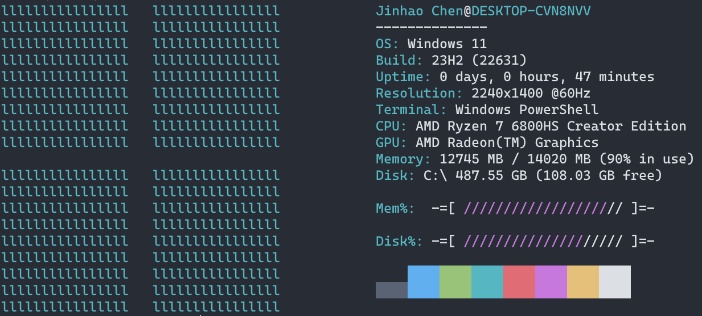
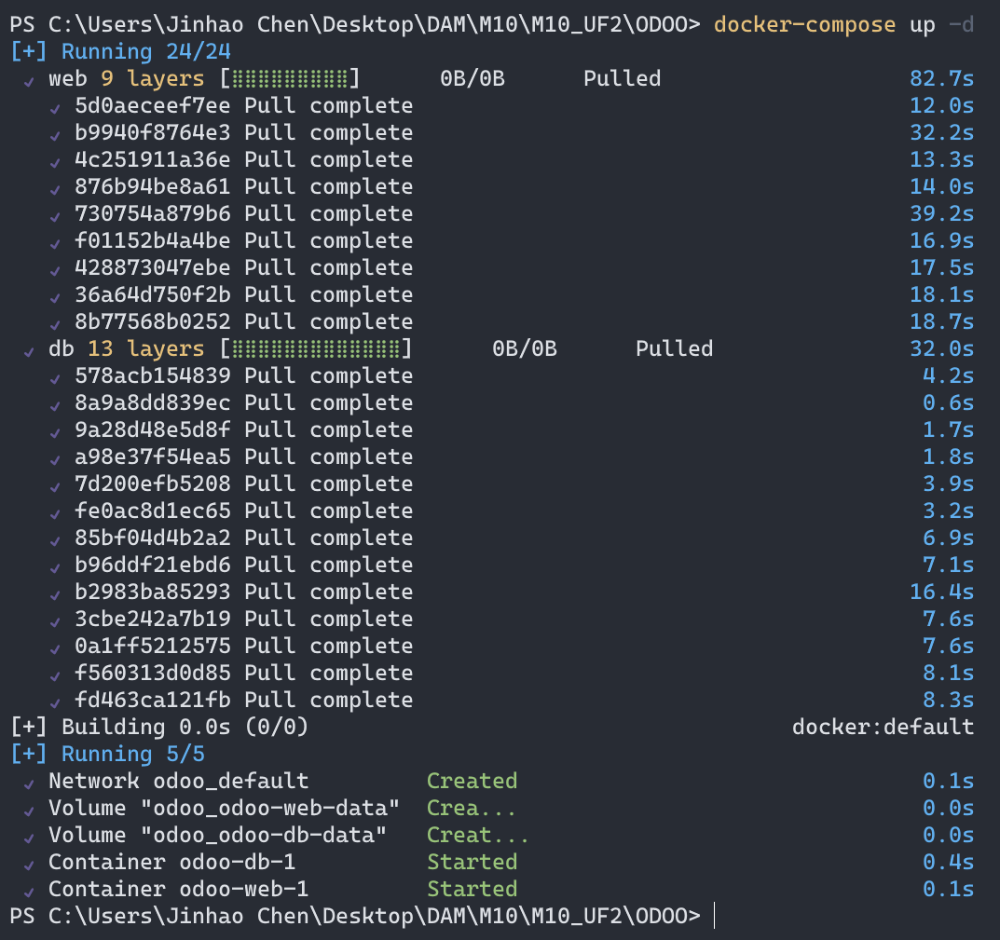
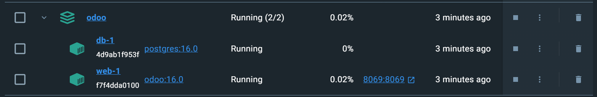
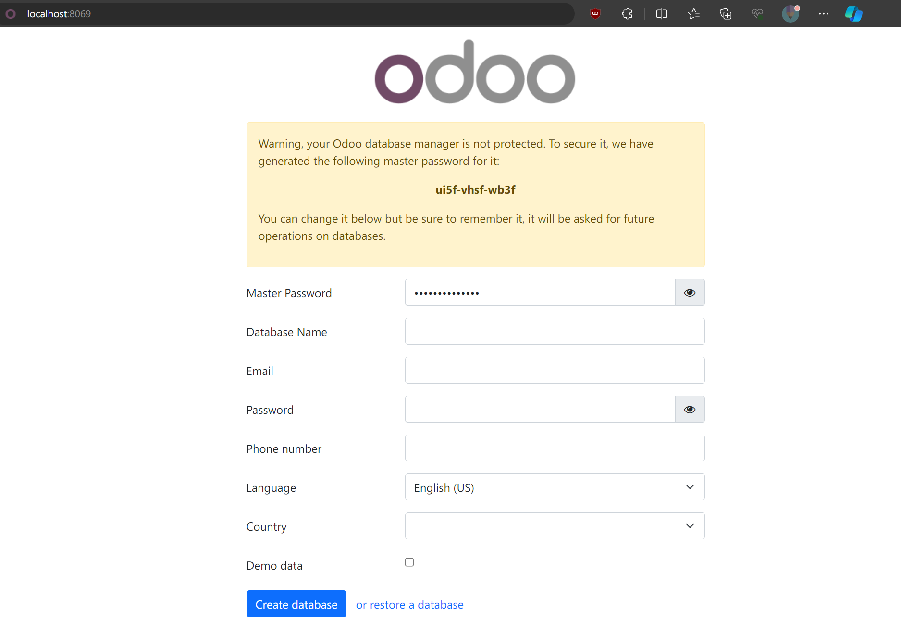

# TUTORIAL ODOO

### ENTORNO

---

Sistema operativo: windows11



Softwares necesarias y sus versiones

docker desktop 24.0.6

[Docker Desktop: The #1 Containerization Tool for Developers | Docker](https://www.docker.com/products/docker-desktop/)

### INSTALACIÓN

---

Crea un archivo con el nombre *docker-compose.yml* con siguiente contenido.

```
version:"3.1"

services:

  web:

    image:odoo:16.0

    depends_on:

    - db

    ports:

    - "8069:8069"

    volumes:

    - odoo-web-data:/var/lib/odoo

    - ./config:/etc/odoo

    - ./addons:/mnt/extra-addons

  db:

    image:postgres:16.0

    environment:

    - POSTGRES_DB=postgres

    - POSTGRES_PASSWORD=odoo

    - POSTGRES_USER=odoo

    - PGDATA=/var/lib/postgresql/data/pgdata

    volumes:

    - odoo-db-data:/var/lib/postgresql/data/pgdata

volumes:

  odoo-web-data:

  odoo-db-data:
```

Se debe modificar el campo de POSTGRES_USER y POSTGRES_PASSWORD

Una vez creado el *docker-compose.yml* ejecuta el docker-desktop y luego en el terminal navega a la carpeta de *docker-compose.yml* y ejecuta:

```
docker-compose up -d
```



Docker con el servidor ODOO levantado



Accediendo el interface web de ODOO desde un navegador con el link:

```
http://localhost:8069/
```


