# M10_UF2

## CREAR TABLA

Antes de crear la tabla:

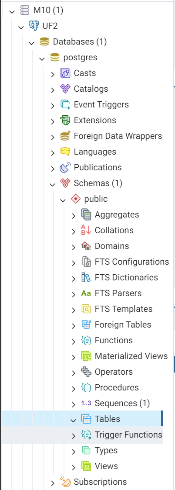

Después de crear la tabla:

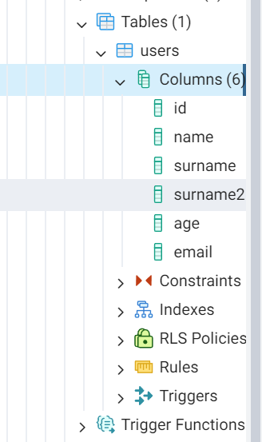

## CREATE

Antes de crear registro:

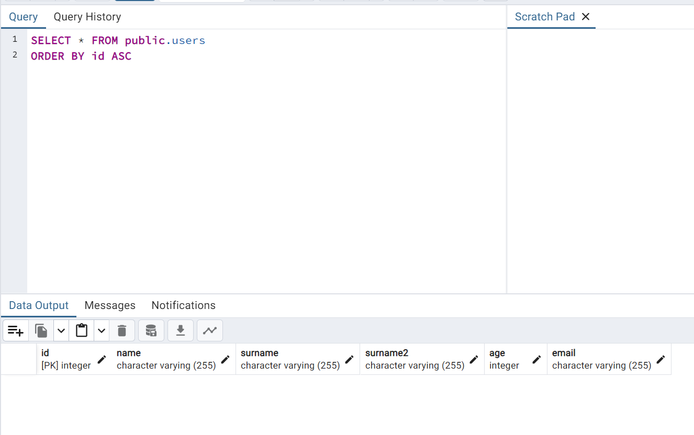

Después de crear registro:

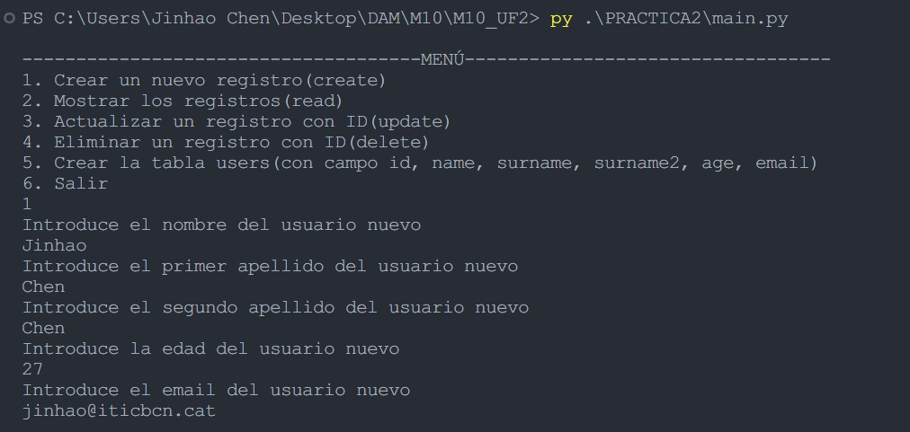

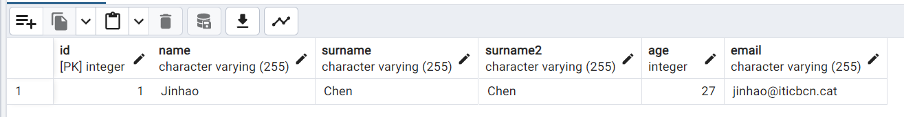

## READ

Pgadmin: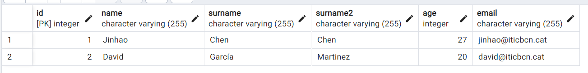

main.py: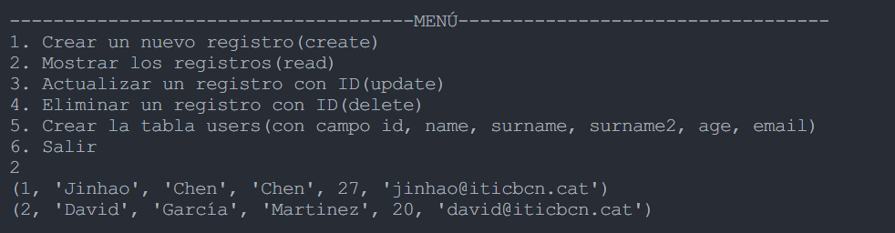

## UPDATE

Antes de update:

Después de update:

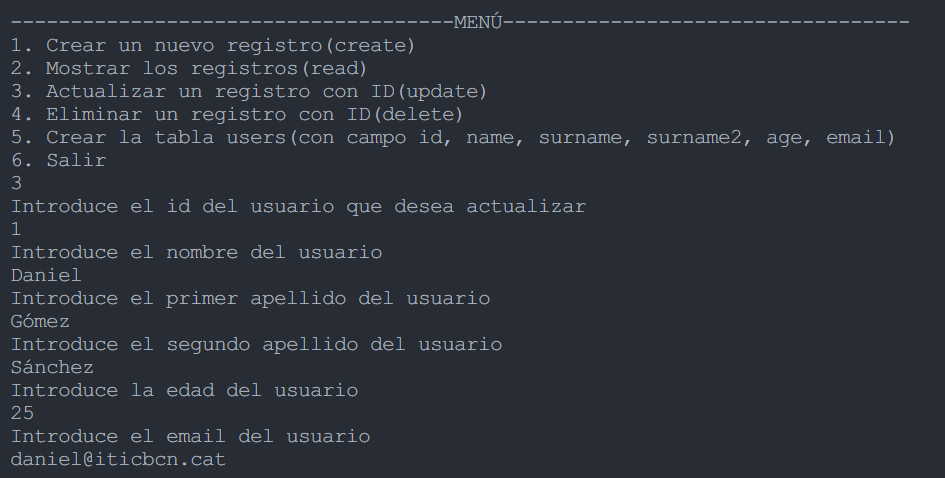

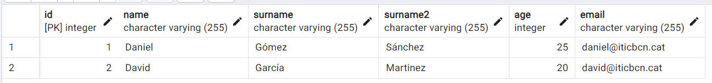

## DELETE

Antes de delete:

Después de delete:

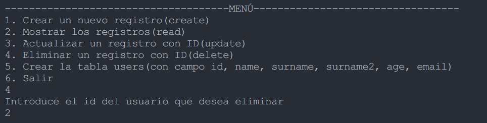

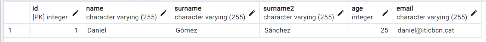
